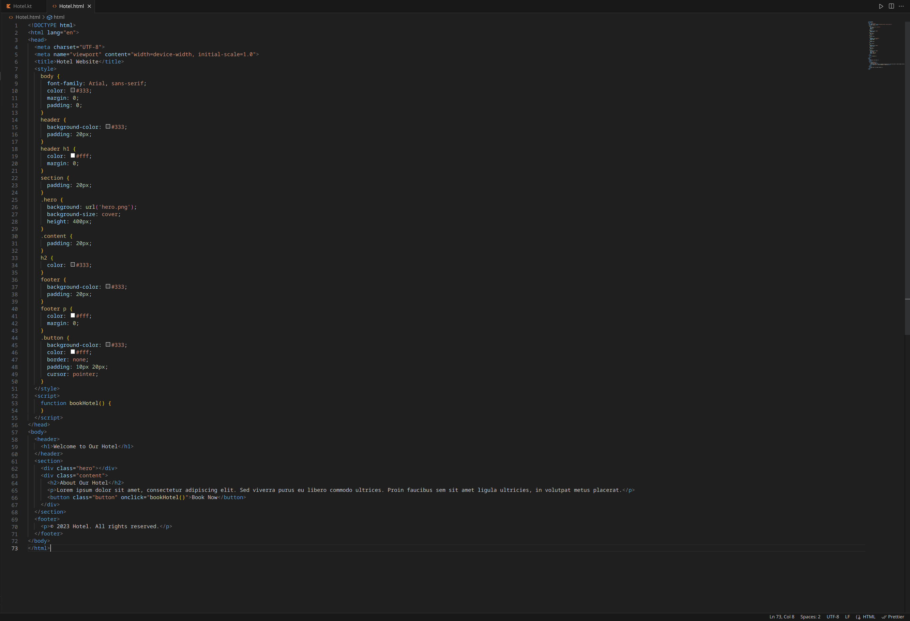
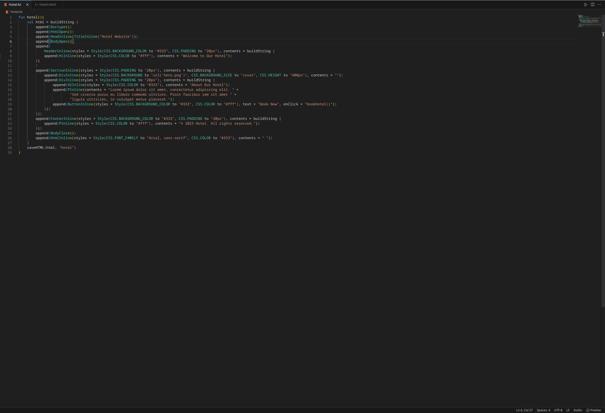
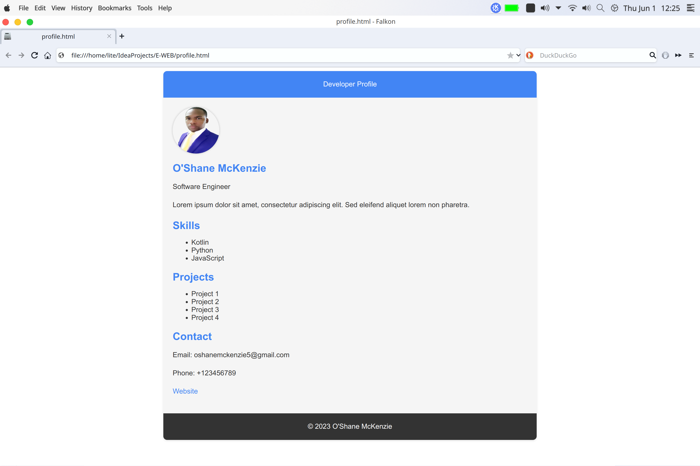
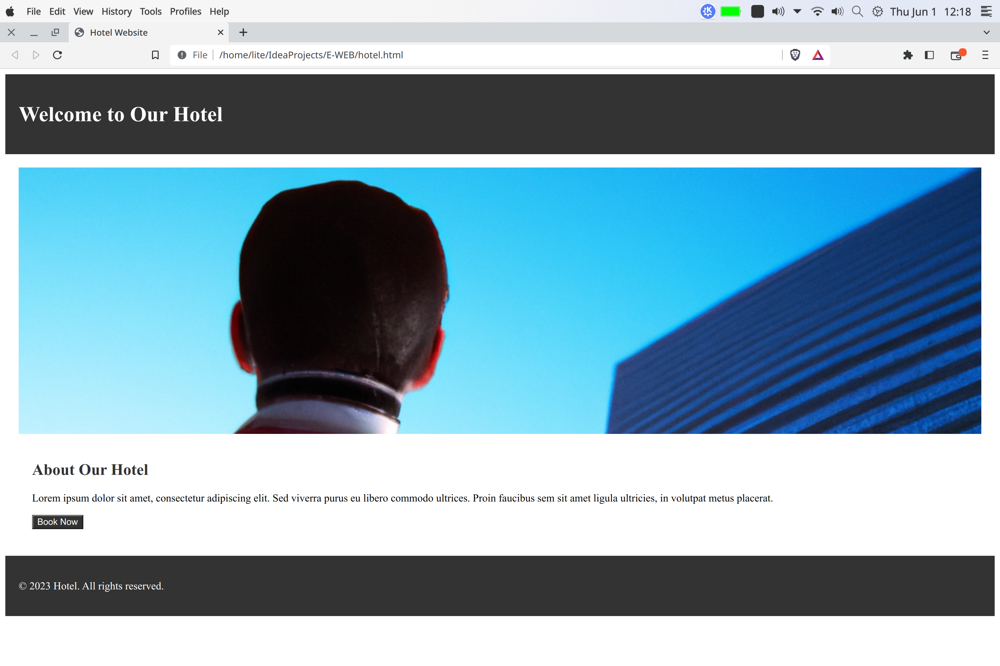

# Project Name: E-WEB (Efficient Webbing)

## Description
The E-WEB project is a collection of reusable CSS classes and HTML components designed to simplify and streamline the process of building web pages. It provides a set of predefined CSS styles and HTML tags that can be easily customized and combined to create consistent and visually appealing user interfaces.

## Features
- **CSS Classes:** The project includes a comprehensive set of CSS classes that cover various aspects of web design, such as layout, typography, colors, borders, and more. Each CSS class is defined with a corresponding value and can be easily applied to HTML elements.
- **HTML Components:** The project offers a wide range of HTML components, including headers, paragraphs, links, images, lists, buttons, forms, and more. These components are designed to be flexible and customizable, allowing developers to quickly create interactive and responsive web pages.
- **Inline Styling:** In addition to the predefined CSS classes, the project provides inline styling functions that allow developers to apply custom styles directly within the HTML tags. This provides greater flexibility in styling individual elements or overriding default styles.
- **Responsive Design:** The CSS Components project follows best practices for responsive design, ensuring that the components adapt well to different screen sizes and devices. It includes CSS classes and media queries that enable developers to create mobile-friendly and responsive layouts.
- **Easy Integration:** The project is designed to be easily integrated into existing web projects. Developers can simply include the project files, apply the desired CSS classes or inline styles, and use the HTML components as needed. No complex setup or configuration is required.

## Code comparison

Here we can see E-WEB uses less code to achieve the same result as standard html and css:

| Regular html and css             | E-WEB                            |
| -----------------------------    | -----------------------------    |
| | |

## Screenshots

Here are some screenshots of webpages created using the project:

1. **Profile**

   

2. **Blog**

   

3. **Hotel**

   

